你还每天都在刷石头的痛苦中吗?还在苦恼连点器启动慢,闪退,失效以及造成的严重设备发热吗?不要再犹豫了,拿起手中的硬币订购吧!MuMu模拟器脚本刷图,只要998!只要998!机不可失失不再来......

本文讲解一下在mumu模拟器中使用脚本刷图的位置选择

## 任务分析

首先我们要明确我们的任务:无脑刷石头.其实再具体点可以大致分成两种:

1.清空本次理智,不吃理智液和碎石

2.清空本次理智液,并且吃理智液和碎石

(不要问我为什么没有只吃理智液不碎石,我不会!!!)

## 界面分析

我们知道明日方舟刷图过程中到达的界面主要由以下几个部分组成:

1. 关卡选择界面

   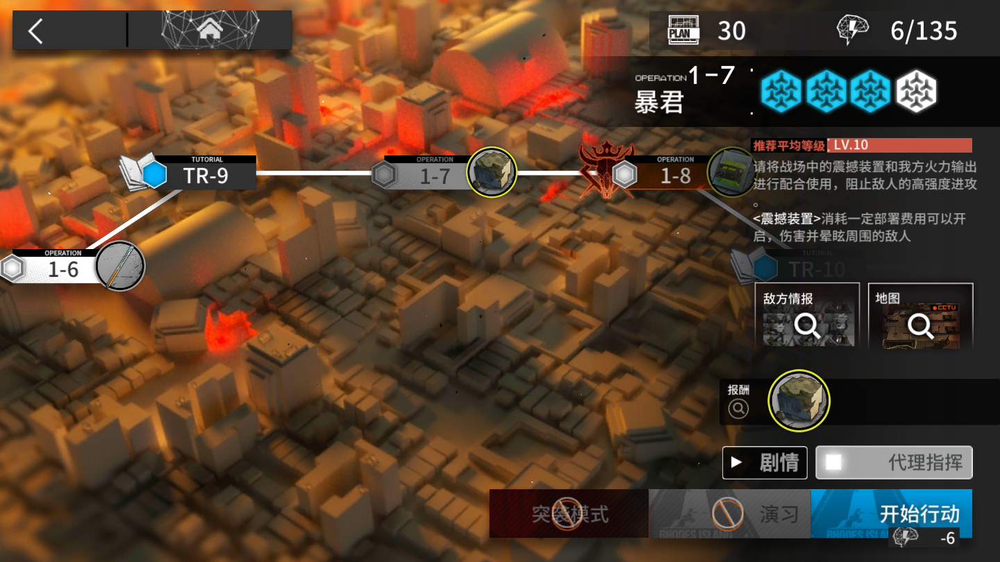
2. 干员选择

   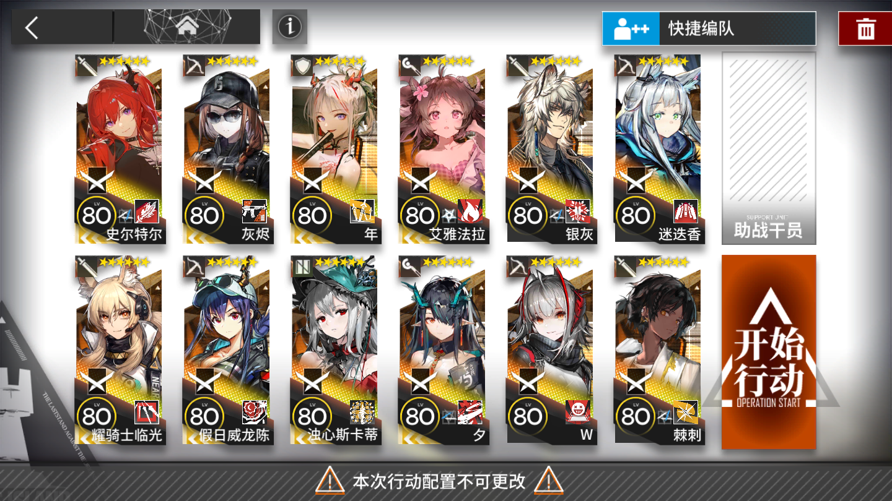
3. 结算界面

   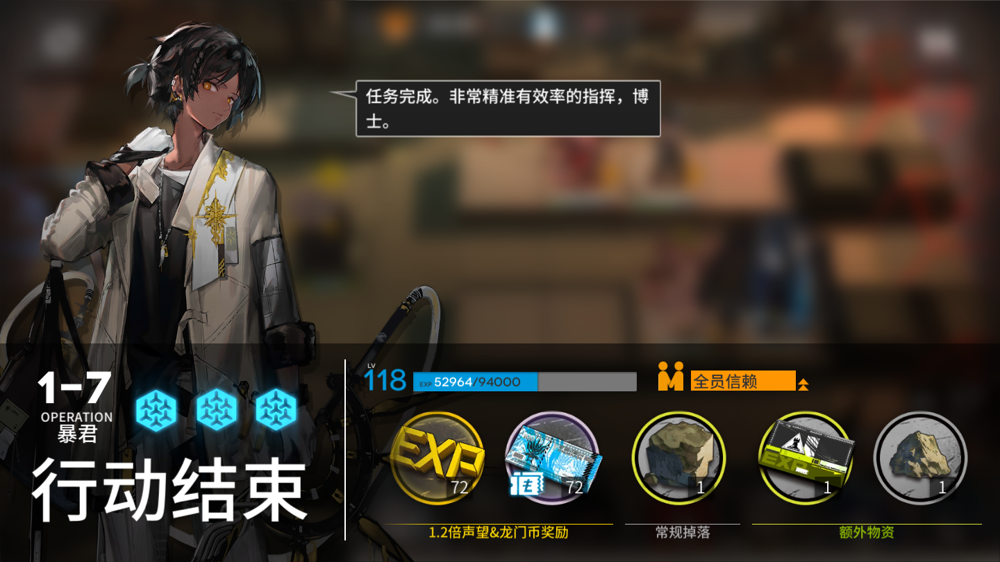
4. 补充理智界面

   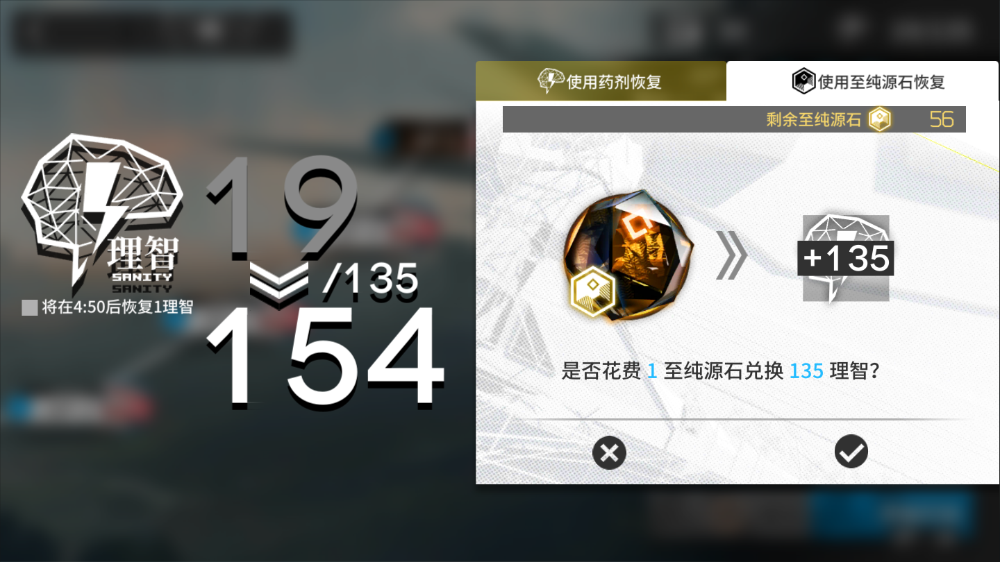

每个界面需要点击的按钮的形状和位置都不完全一样.

将每个界面的按钮列出来:

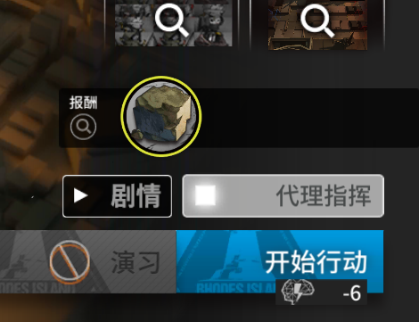

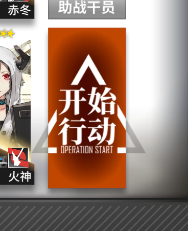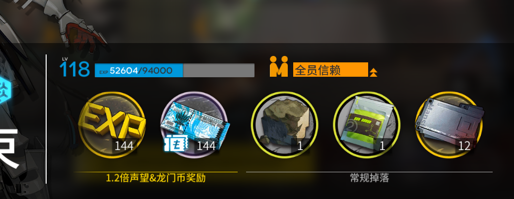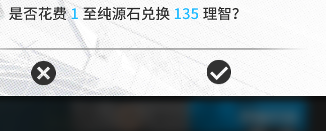

要想顺利进入下一个界面,需要点击相应界面中合适的元素或区域,否则可能会进入其他界面或导致界面变化.

我们将其点击的结果分为四类:符合预期,无变化,偏离预期和不确定.

用绿,无色,红,黄 四种滤镜对应,将其在图中标出来:

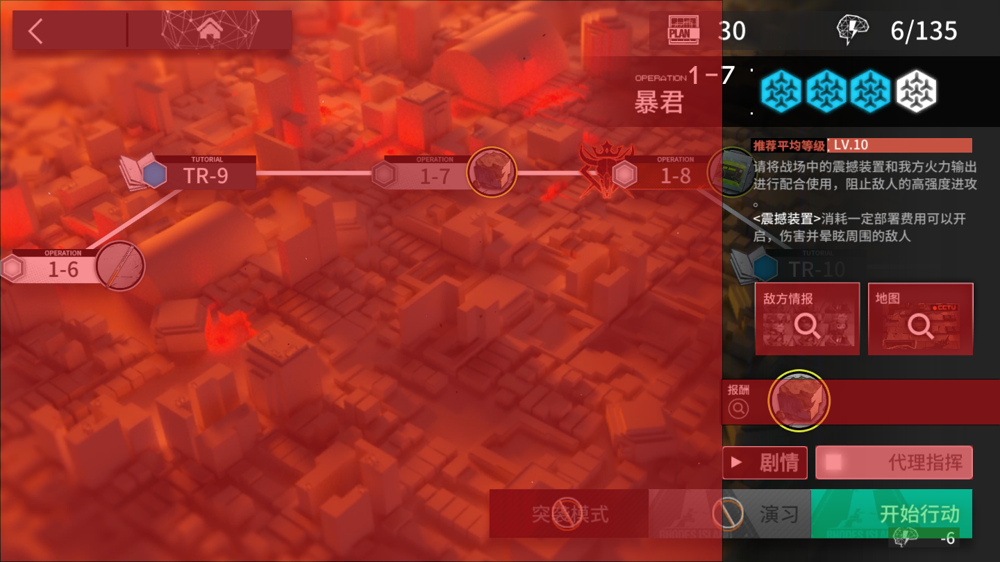

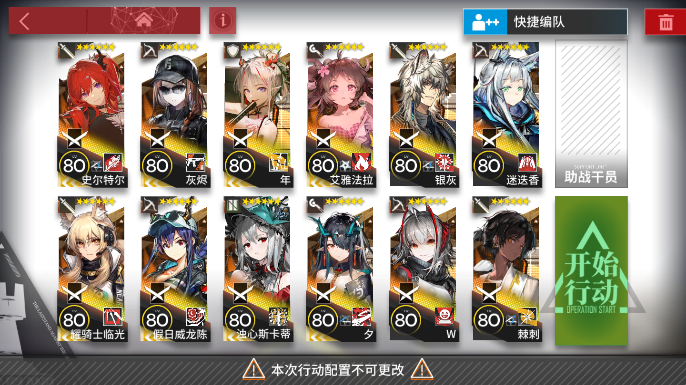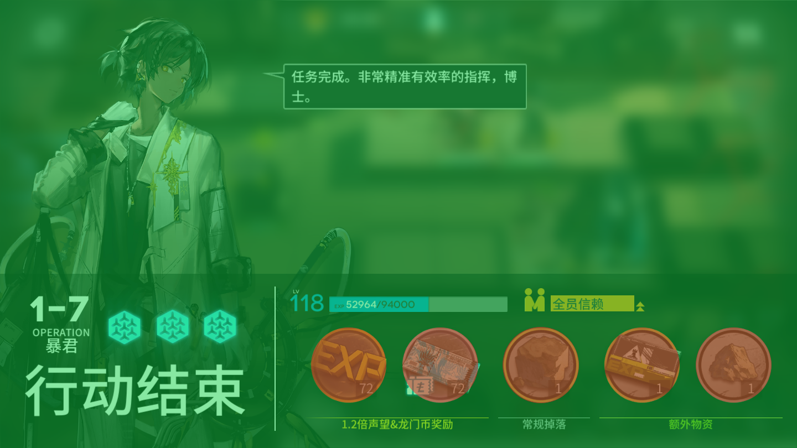

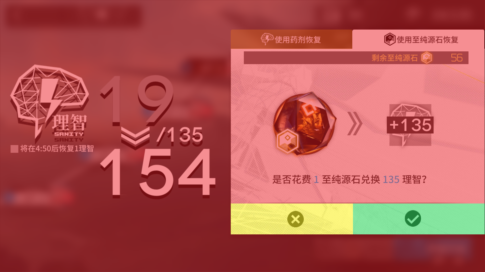

不难发现,其中有重合之处.但仅仅这样看还不够直观,我们将按钮按其位置叠加起来试试:

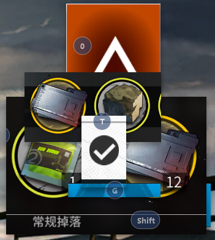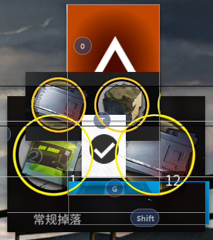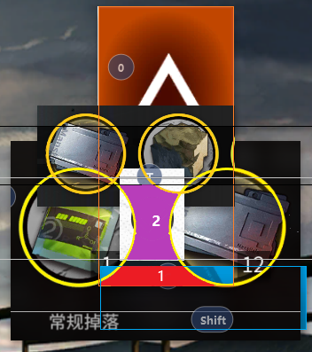

()这里请忽略掉我设置的按键,不过也可以当个参考).发现有两片区域完美地符合我们的要求,于是:

## 结论分析

我们可以根据上图分析出以下路线:

1.无脑点击区域1(红),则脚本会依次进入:关卡选择界面-干员选择-结算界面-关卡选择界面......成功进入不吃理智液的循环(α线)

2.对区域1(红)和区域2(紫)进行包含奇数次交替点击的动作,如121212,121211111,1112221234567....(正常人都会选第一种吧喂),则脚本还是会进入上述路线,只不过当理智耗尽的时候会自动吃药,当然这种方法是会碎石的,如果不设置时间加以限制,后果不堪设想......关于时间设定,每关都有由出怪逻辑决定的最小时间,这里不打算展开讨论,按1-7的大概时间来算就是1m25s,根据这个时间计算出清空一管理智的总时间为135/6*(1:25)=31.875m,算上这个时间内自然回复的大约5点理智,约33min即可刚好全部清空,135理智/33min=4.09理智/min,根据此值换算好理智液需要的总时间,那么我们成功进入吃理智液的循环(β线)

3脚本的能力是有限的,所以,我不做脚本啦(愤怒地进化为CV).......那么我们假装成功进入.......第三条线了(Steins;Gate线)

(完)
